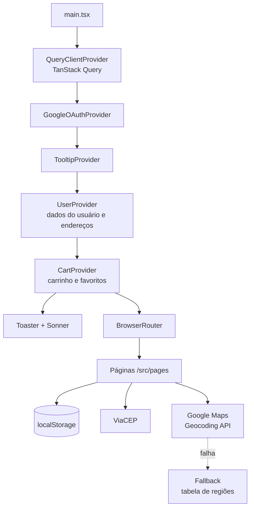
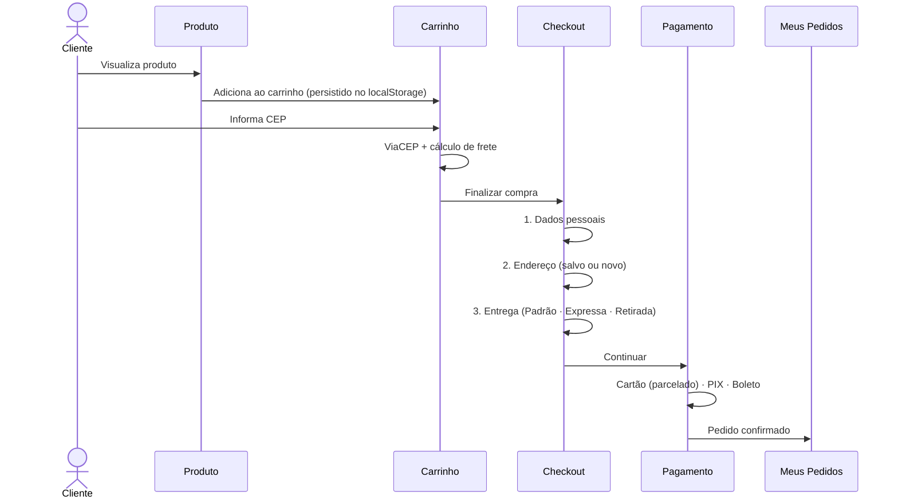

<div align="center">

# 🏗️ COISA — E-commerce de Materiais de Construção

**Loja virtual mobile-first para materiais de construção, com cálculo de frete por geolocalização, checkout em etapas, avaliações de produtos e painel administrativo.**

[](https://react.dev/)
[](https://www.typescriptlang.org/)
[](https://vitejs.dev/)
[](https://tailwindcss.com/)
[](https://ui.shadcn.com/)
[](./LICENSE)


[Visão geral](#-visão-geral) •
[Funcionalidades](#-funcionalidades) •
[Arquitetura](#-arquitetura) •
[Frete](#-motor-de-cálculo-de-frete) •
[Instalação](#-começando) •
[Configuração](#%EF%B8%8F-configuração) •
[Roadmap](#%EF%B8%8F-roadmap)

</div>

---

## 📋 Sumário

- [Visão geral](#-visão-geral)
- [Status do projeto](#-status-do-projeto)
- [Funcionalidades](#-funcionalidades)
- [Stack tecnológica](#-stack-tecnológica)
- [Arquitetura](#-arquitetura)
- [Estrutura de pastas](#-estrutura-de-pastas)
- [Rotas da aplicação](#-rotas-da-aplicação)
- [Motor de cálculo de frete](#-motor-de-cálculo-de-frete)
- [Fluxo de compra](#-fluxo-de-compra)
- [Gerenciamento de estado](#-gerenciamento-de-estado)
- [Começando](#-começando)
- [Configuração](#%EF%B8%8F-configuração)
- [Scripts disponíveis](#-scripts-disponíveis)
- [Design system e responsividade](#-design-system-e-responsividade)
- [Segurança e LGPD](#-segurança-e-lgpd)
- [Limitações conhecidas](#%EF%B8%8F-limitações-conhecidas)
- [Roadmap](#%EF%B8%8F-roadmap)
- [Contribuindo](#-contribuindo)
- [Licença](#-licença)
- [Autor](#-autor)

---

## 🎯 Visão geral

O **COISA** é a vitrine digital de uma loja física de materiais de construção localizada em **Santo André – SP**. O objetivo do projeto é levar a experiência de balcão para o digital: o cliente encontra o produto, calcula o frete para o seu CEP em tempo real, monta o carrinho e conclui o pedido escolhendo entre entrega padrão, expressa ou retirada na loja.

O projeto foi construído com foco em três pilares:

| Pilar | Como se materializa no código |
| --- | --- |
| **Mobile-first** | Layouts pensados primeiro para 320px, menu lateral (sheet) no lugar de bottom navigation, alvos de toque amplos |
| **Frete preciso** | Geocodificação via Google Maps, distância Haversine com fator de rota, peso real × volumétrico, seguro sobre valor do pedido e fallback offline por tabela de regiões |
| **Confiança na compra** | Avaliações de compradores verificados, páginas de pós-venda, assistência técnica, FAQ, Termos de Uso e Política de Privacidade alinhada à LGPD |

---

## 🚦 Status do projeto

> [!IMPORTANT]
> O COISA está em estágio de **protótipo funcional de front-end**. Toda a interface, navegação e regras de negócio do lado do cliente estão implementadas, porém **ainda não há back-end conectado**: catálogo, usuários, pedidos, pagamentos e relatórios utilizam **dados simulados (mock)**. Consulte [Limitações conhecidas](#%EF%B8%8F-limitações-conhecidas) e o [Roadmap](#%EF%B8%8F-roadmap) antes de considerar o uso em produção.

| Módulo | Situação |
| --- | --- |
| Catálogo, busca e filtros | ✅ Funcional (dados estáticos) |
| Carrinho e favoritos | ✅ Funcional com persistência em `localStorage` |
| Cálculo de frete | ✅ Funcional (Google Maps + fallback) |
| Checkout em etapas | 🟡 Interface completa; itens do pedido ainda simulados |
| Pagamento (Cartão, PIX, Boleto) | 🟡 Interface completa; processamento simulado |
| Login e cadastro (e-mail, Google, Facebook) | 🟡 Interface e OAuth integrados; sessão simulada |
| Painel administrativo e relatórios | 🟡 Interface completa; dados simulados, rota sem proteção |
| Back-end / banco de dados | 🔴 Não implementado (apenas *stub* de conexão PostgreSQL) |

---

## ✨ Funcionalidades

### 🛍️ Catálogo e descoberta
- **Listagem de produtos** com filtros por categoria, faixa de preço e avaliação (`/produtos`).
- **Busca com sugestões** em tempo real no cabeçalho (`SearchBox`).
- **Página de detalhes** com galeria, especificações, avaliações e calculadora de frete embutida (`/produto/:id`).
- **Página de ofertas** com preço original × preço promocional (`/ofertas`).
- **Categorias atuais:** Tintas e Acabamentos · Ferramentas · Cimentos e Argamassas · Pisos e Revestimentos · Tijolos e Blocos · Areias e Britas.

### 🛒 Carrinho e lista de desejos
- Adicionar, remover e alterar quantidades, com contador visual no cabeçalho.
- **Lista de desejos** integrada ao mesmo contexto do carrinho (`/desejos`).
- **Persistência local** (`coisa_cart_items` e `coisa_favorite_items` no `localStorage`), mantendo o carrinho mesmo sem login.
- Notificações de feedback via *toasts* (Radix Toast + Sonner).

### 🚚 Frete e entrega
- Busca automática de endereço por CEP via **ViaCEP**.
- Cálculo de frete detalhado (distância, peso, manuseio, seguro) — ver [Motor de cálculo de frete](#-motor-de-cálculo-de-frete).
- Três modalidades no checkout: **Entrega Padrão**, **Entrega Expressa** (+ R$ 15,00) e **Retirar na Loja** (grátis).
- Prazo estimado de entrega calculado pela distância.

### 💳 Checkout e pagamento
- Checkout em **3 etapas guiadas** — Dados Pessoais → Endereço → Entrega — com indicador de progresso e validação por etapa.
- Seleção de endereços salvos ou cadastro de novo endereço durante a compra.
- Tela de pagamento com **Cartão de Crédito (com parcelamento)**, **PIX** e **Boleto Bancário**.

### 👤 Conta do cliente
- Login por e-mail/senha, **Google OAuth** e **Facebook Login**; cadastro em duas etapas e recuperação de senha.
- **Minha Conta:** edição de dados pessoais e gestão de múltiplos endereços (adicionar, remover, definir principal).
- **Meus Pedidos:** histórico e acompanhamento de pedidos.

### ⭐ Avaliações
- Notas de 1 a 5 estrelas com comentário opcional.
- Selo de **comprador verificado** — somente quem comprou o produto pode avaliar.
- Resumo de avaliações (média e distribuição por estrelas) e filtro por nota.

### 🧑‍💼 Administração
- **Painel administrativo** (`/admin`) com abas de Dashboard, Produtos, Banners e Configurações.
- **Relatório de vendas** (`/relatorio-vendas`) com gráficos construídos em Recharts.

### 🏢 Institucional e suporte
- Páginas de **Assistência Técnica**, **Entrega**, **Pós-venda**, **Sobre Nós** e **FAQ** categorizado.
- Atendimento e orçamentos via **WhatsApp** (links `wa.me` com mensagem pré-preenchida).
- **Termos de Uso** e **Política de Privacidade** alinhada à LGPD.

---

## 🧰 Stack tecnológica

| Camada | Tecnologias |
| --- | --- |
| **Linguagem** | TypeScript 5.8 |
| **UI** | React 18.3, React Router DOM 6 |
| **Build / Dev server** | Vite 5 + `@vitejs/plugin-react-swc` |
| **Estilização** | Tailwind CSS 3.4, `tailwindcss-animate`, `@tailwindcss/typography` |
| **Componentes** | shadcn/ui sobre Radix UI, Lucide React (ícones), Embla Carousel, Vaul (drawer), cmdk |
| **Formulários** | React Hook Form + Zod (`@hookform/resolvers`) |
| **Estado** | React Context API (`UserContext`, `CartContext`) + TanStack Query (provider configurado) |
| **Gráficos** | Recharts |
| **Autenticação social** | `@react-oauth/google`, `react-facebook-login` |
| **APIs externas** | ViaCEP, Google Maps Geocoding API, Nominatim/OpenStreetMap (fallback) |
| **Qualidade** | ESLint 9 + `typescript-eslint`, `eslint-plugin-react-hooks` |
| **Dependências reservadas** | `firebase`, `pg`, `dotenv` (instaladas para a futura camada de dados; ainda não utilizadas no `src/`) |

---

## 🏛️ Arquitetura

Aplicação **SPA (Single Page Application)** renderizada no cliente. Os *providers* globais envolvem o roteador na seguinte ordem:



**Princípios de organização**

- `pages/` contém uma tela por rota; `components/` reúne blocos reutilizáveis de domínio; `components/ui/` contém as primitivas do shadcn/ui.
- A regra de negócio de frete é isolada em `utils/`, desacoplada da interface.
- O alias `@/` aponta para `src/` (configurado em `vite.config.ts` e `tsconfig.json`).

---

## 📁 Estrutura de pastas

```
Coisa/
├── src/
│   ├── components/
│   │   ├── ui/                      # Primitivas shadcn/ui (button, dialog, sheet, tabs, toast…)
│   │   ├── Header.tsx               # Cabeçalho responsivo, busca e menu mobile (sheet)
│   │   ├── Footer.tsx               # Rodapé com links institucionais e WhatsApp
│   │   ├── Hero.tsx                 # Seção de destaque da home
│   │   ├── BannerCarousel.tsx       # Carrossel de banners (Embla)
│   │   ├── Categories.tsx           # Grade de categorias
│   │   ├── FeaturedProducts.tsx     # Vitrine de destaques
│   │   ├── LogoStrip.tsx            # Faixa de marcas parceiras
│   │   ├── SearchBox.tsx            # Busca com sugestões
│   │   ├── ShippingCalculator.tsx   # Calculadora de frete por CEP
│   │   ├── ProductReview.tsx        # Formulário e listagem de avaliações
│   │   ├── ReviewSummary.tsx        # Média e distribuição de notas
│   │   ├── RatingFilter.tsx         # Filtro por nota
│   │   ├── SalesChart.tsx           # Gráficos do relatório de vendas
│   │   ├── SocialButtons.tsx        # Botões de login Google/Facebook
│   │   └── TestProducts.tsx         # Produtos para testes internos
│   ├── config/
│   │   └── socialAuth.ts            # Client IDs de OAuth (Google/Facebook)
│   ├── context/
│   │   ├── UserContext.tsx          # Usuário logado e endereços
│   │   └── CartContext.tsx          # Carrinho + favoritos + persistência
│   ├── hooks/
│   │   ├── useProductReviews.ts     # Avaliações por produto
│   │   ├── useGlobalProductReviews.ts
│   │   ├── useSocialAuth.ts         # Fluxos de login social
│   │   ├── use-mobile.tsx           # Detecção de breakpoint mobile
│   │   └── use-toast.ts
│   ├── lib/
│   │   └── utils.ts                 # Helper `cn()` (clsx + tailwind-merge)
│   ├── pages/                       # Uma tela por rota (ver tabela de rotas)
│   ├── utils/
│   │   ├── googleFreightCalculator.ts      # ⭐ Motor de frete em uso
│   │   ├── googleMapsFreightCalculator.ts  # Variante Google Maps + Nominatim
│   │   ├── advancedFreightCalculator.ts    # Variante Nominatim (sem Google)
│   │   ├── distanceCalculator.ts           # Tabela de coordenadas por prefixo de CEP
│   │   └── testGoogleMaps.ts               # Diagnóstico da API do Google
│   ├── App.tsx                      # Providers + definição de rotas
│   ├── main.tsx                     # Ponto de entrada
│   └── index.css                    # Tokens de tema (CSS variables) + Tailwind
├── db.js                            # Stub de conexão PostgreSQL (pg Pool)
├── env.example                      # Variáveis de ambiente do banco
├── SOCIAL_LOGIN_SETUP.md            # Guia de configuração do OAuth
├── components.json                  # Configuração do shadcn/ui
├── tailwind.config.ts
├── vite.config.ts
└── package.json
```

---

## 🧭 Rotas da aplicação

| Rota | Página | Descrição |
| --- | --- | --- |
| `/` | `Index` | Home: hero, banners, categorias e destaques |
| `/produtos` | `Produtos` | Catálogo com filtros |
| `/produto/:id` | `ProdutoDetalhe` | Detalhes, avaliações e frete |
| `/ofertas` | `Ofertas` | Produtos em promoção |
| `/carrinho` | `Carrinho` | Carrinho e cálculo de frete |
| `/desejos` | `WishlistPage` | Lista de desejos |
| `/checkout` | `Checkout` | Checkout em 3 etapas |
| `/pagamento` | `Pagamento` | Cartão, PIX ou Boleto |
| `/login` | `Login` | Login, cadastro e login social |
| `/esqueci-senha` | `EsqueciSenha` | Recuperação de senha |
| `/minha-conta` | `MinhaConta` | Dados pessoais e endereços |
| `/meus-pedidos` | `MeusPedidos` | Histórico de pedidos |
| `/assistencia` | `Assistencia` | Assistência técnica |
| `/entrega` | `Entrega` | Políticas e modalidades de entrega |
| `/pos-venda` | `PosVenda` | Trocas, devoluções e suporte |
| `/sobre-nos` | `SobreNos` | Institucional |
| `/faq` | `FAQ` | Perguntas frequentes |
| `/termos-de-uso` | `TermosDeUso` | Termos de Uso |
| `/politica-privacidade` | `PoliticaPrivacidade` | Política de Privacidade (LGPD) |
| `/admin` | `Admin` | Painel administrativo |
| `/relatorio-vendas` | `RelatorioVendas` | Relatório de vendas |
| `/teste-carrinho` · `/teste-frete` | — | Páginas de teste para desenvolvimento |
| `*` | `NotFound` | Página 404 |

---

## 🚚 Motor de cálculo de frete

O cálculo vive em [`src/utils/googleFreightCalculator.ts`](./src/utils/googleFreightCalculator.ts) e é consumido pelo carrinho, pelo checkout e pela `ShippingCalculator`, por meio da função pública `calculateFreightForCart(cep, cartItems)`.

### Pipeline

```mermaid
flowchart LR
    A[CEP do cliente] --> B{Coordenadas<br/>em cache?}
    B -- sim --> D
    B -- não --> C[Google Maps<br/>Geocoding API]
    C --> D[Haversine<br/>loja → cliente]
    D --> E[Fator de rota<br/>×1,30 até 150 km<br/>×1,22 acima]
    E --> F[Peso tarifável =<br/>max&#40;real, volumétrico&#41;]
    F --> G[Soma das taxas]
    G --> H{Pedido ≥ limite<br/>de frete grátis?}
    H -- sim --> I[Frete = R$ 0,00]
    H -- não --> J[Aplica mínimo<br/>e máximo]
    C -. erro .-> K[Fallback:<br/>tabela de distâncias<br/>por prefixo de CEP]
    K --> E
```



### Fórmula

```
distância_ajustada = haversine(loja, cliente) × fator_de_rota
peso_volumétrico   = (comprimento × largura × altura) / 6000
peso_tarifável     = max(peso_real, peso_volumétrico)

frete = taxa_base
      + distância_ajustada × R$/km
      + peso_tarifável     × R$/kg
      + nº_de_itens        × manuseio
      + valor_do_pedido    × % seguro
```

### Parâmetros atuais (`PARAMS`)

| Parâmetro | Valor | Descrição |
| --- | --- | --- |
| `baseFee` | R$ 6,00 | Taxa fixa por pedido |
| `perKm` | R$ 1,10 | Custo por km (distância ajustada) |
| `perKg` | R$ 1,20 | Custo por kg tarifável |
| `perItemHandling` | R$ 0,80 | Manuseio por unidade |
| `volumetricDivisor` | 6000 | Divisor de peso cúbico (padrão de mercado) |
| `valueInsurancePct` | 0,3% | Seguro sobre o valor do pedido |
| `freeShippingThreshold` | R$ 199,00 | Pedido mínimo para frete grátis |
| `minFreight` / `maxFreight` | R$ 5,00 / R$ 50,00 | Piso e teto do frete |

Produtos sem dimensões cadastradas recebem uma embalagem padrão de **0,5 kg · 25 × 20 × 15 cm**.

### Prazo estimado

| Distância ajustada | Prazo (dias úteis) |
| --- | --- |
| até 10 km | 1 – 3 |
| até 50 km | 3 – 5 |
| até 200 km | 5 – 6 |
| acima de 200 km | 6 – 8 |

### Resiliência

- **Cache de coordenadas em memória** com validade de 24 h, evitando chamadas repetidas à API.
- **Fallback automático**: se a geocodificação falhar, a distância é estimada por uma tabela de regiões baseada no prefixo do CEP, mantendo o checkout operante.
- O resultado (`FreightBreakdown`) expõe cada componente da tarifa, permitindo exibir ao cliente a composição completa do frete.

---

## 🧾 Fluxo de compra



---

## 🧠 Gerenciamento de estado

| Contexto | Responsabilidade | Persistência |
| --- | --- | --- |
| `UserContext` | Dados do usuário (nome, e-mail, telefone, CPF) e CRUD de endereços com endereço principal | Memória (dados simulados) |
| `CartContext` | Itens do carrinho, quantidades, totais, contador e lista de desejos | `localStorage` |

Os hooks `useUser()` e `useCart()` expõem esses contextos e lançam erro explícito se usados fora de seus *providers*.

---

## 🚀 Começando

### Pré-requisitos

- **Node.js 18+** (recomendado: 20 LTS)
- **npm 9+**
- Uma chave da **Google Maps Geocoding API** (opcional — sem ela, o frete usa o fallback por região)

### Instalação

```bash
# 1. Clone o repositório
git clone https://github.com/theohidekii/Coisa.git
cd Coisa

# 2. Instale as dependências
npm install --legacy-peer-deps

# 3. Inicie o servidor de desenvolvimento
npm run dev
```

A aplicação ficará disponível em **http://localhost:8080**.

> [!NOTE]
> A flag `--legacy-peer-deps` é necessária porque `react-facebook-login@4` declara *peer dependency* em React 16, enquanto o projeto usa React 18. A biblioteca funciona normalmente; a substituição por uma alternativa mantida está no [Roadmap](#%EF%B8%8F-roadmap).

### Build de produção

```bash
npm run build     # gera a pasta dist/
npm run preview   # serve o build localmente para validação
```

O conteúdo de `dist/` é estático e pode ser publicado em Vercel, Netlify, Cloudflare Pages ou em qualquer servidor Nginx. Por ser uma SPA, configure o servidor para redirecionar todas as rotas para `index.html`:

```nginx
location / {
    try_files $uri $uri/ /index.html;
}
```

---

## ⚙️ Configuração

### Login social

Siga o guia completo em [`SOCIAL_LOGIN_SETUP.md`](./SOCIAL_LOGIN_SETUP.md). Em resumo, preencha em `src/config/socialAuth.ts`:

```ts
export const GOOGLE_CLIENT_ID = "seu-client-id.apps.googleusercontent.com";
export const FACEBOOK_APP_ID  = "seu-app-id";
```

Cadastre `http://localhost:8080` como origem autorizada no Google Cloud Console e no Facebook Developers (o servidor de desenvolvimento roda na porta **8080**).

### Google Maps (frete)

A chave da Geocoding API é lida em `src/utils/googleFreightCalculator.ts`. A configuração recomendada é movê-la para uma variável de ambiente Vite:

```bash
# .env.local  (não versionar)
VITE_GOOGLE_MAPS_API_KEY=sua-chave-aqui
```

```ts
const GOOGLE_API_KEY = import.meta.env.VITE_GOOGLE_MAPS_API_KEY;
```

> [!WARNING]
> Chaves usadas no navegador ficam visíveis para qualquer visitante. No Google Cloud Console, **restrinja a chave por referenciador HTTP** (seu domínio) e **por API** (apenas Geocoding).

### Banco de dados (preparação)

O arquivo `db.js` contém um *pool* de conexão PostgreSQL destinado à futura API. Copie `env.example` para `.env` e ajuste:

| Variável | Descrição |
| --- | --- |
| `PGHOST` | Host do PostgreSQL |
| `PGPORT` | Porta (padrão `5432`) |
| `PGUSER` | Usuário da aplicação |
| `PGPASSWORD` | Senha |
| `PGDATABASE` | Nome do banco |

### Dados da loja

| Item | Onde alterar |
| --- | --- |
| CEP de origem do frete (`09130-410`) | `WAREHOUSE_CEP` em `src/utils/googleFreightCalculator.ts` |
| Tabela de preços do frete | `PARAMS` no mesmo arquivo |
| Número de WhatsApp | Links `wa.me` em `Footer`, `Entrega`, `PosVenda`, `Assistencia` e `SobreNos` |
| Catálogo de produtos | `src/pages/Produtos.tsx`, `src/components/FeaturedProducts.tsx` e `src/components/SearchBox.tsx` |

---

## 📜 Scripts disponíveis

| Comando | Descrição |
| --- | --- |
| `npm run dev` | Servidor de desenvolvimento com HMR (porta 8080) |
| `npm run build` | Build de produção otimizado em `dist/` |
| `npm run build:dev` | Build em modo *development* (útil para depuração) |
| `npm run preview` | Serve o build de produção localmente |
| `npm run lint` | Análise estática com ESLint |

---

## 🎨 Design system e responsividade

- **Tokens de tema** definidos como CSS variables em `src/index.css` e mapeados no `tailwind.config.ts` (paleta principal em azul, base `slate`).
- **Componentes shadcn/ui** (estilo `default`) sobre Radix UI, garantindo acessibilidade por teclado e leitores de tela.
- **Ícones** consistentes com Lucide React.
- **Breakpoints** cobertos: smartphones (≥ 320px), tablets (≥ 768px), desktops (≥ 1024px) e telas grandes (≥ 1440px).
- **Navegação mobile** concentrada em um menu lateral com acesso rápido a *Minha Conta* e *Meus Pedidos*.

---

## 🔒 Segurança e LGPD

- **Política de Privacidade** e **Termos de Uso** redigidos com base na Lei Geral de Proteção de Dados (Lei nº 13.709/2018).
- **Minimização de dados**: o CPF é solicitado apenas no cadastro; o login social coleta somente nome e e-mail.
- Senhas de contas sociais nunca trafegam pela aplicação (fluxo OAuth delegado ao provedor).
- Validação de formulários em todas as etapas de cadastro e checkout.

> [!CAUTION]
> Por ser um front-end sem servidor, **nenhuma regra de autorização é garantida no cliente**. Antes de publicar em produção: proteja `/admin` e `/relatorio-vendas` com autenticação no servidor, mantenha segredos fora do repositório e processe pagamentos exclusivamente por um gateway (back-end).

---

## ⚠️ Limitações conhecidas

Transparência sobre o estado atual, para quem for evoluir o projeto:

| # | Limitação | Impacto |
| --- | --- | --- |
| 1 | Catálogo, usuário, pedidos e vendas são **dados mockados** no código | Não há persistência entre dispositivos |
| 2 | O `Checkout` usa uma **lista de itens fixa** em vez do `CartContext` | O resumo do checkout não reflete o carrinho real |
| 3 | O `CartContext` consome `user`/`isLoggedIn`, que o `UserContext` não expõe | A sincronização carrinho ↔ usuário no login não é disparada |
| 4 | Limite de frete grátis divergente: **R$ 150** na interface × **R$ 199** no motor de frete | Mensagens e valores podem não coincidir |
| 5 | Pagamento é **simulado** (sem gateway) | Nenhuma cobrança real é feita |
| 6 | `/admin` e `/relatorio-vendas` **sem proteção de rota** | Qualquer visitante acessa o painel |
| 7 | Três implementações de frete coexistem em `utils/` (apenas `googleFreightCalculator` está em uso) | Código duplicado |
| 8 | Bundle único de ~724 kB (≈ 187 kB gzip), sem *code splitting* por rota | Carregamento inicial mais pesado em redes móveis |
| 9 | `db.js` usa CommonJS (`require`) em um pacote `"type": "module"` | Precisa ser convertido para ESM ou `.cjs` ao criar a API |
| 10 | Erro de sintaxe em `src/components/ui/pagination.tsx` e 23 erros de lint | `tsc --noEmit` e `npm run lint` não passam (o build do Vite conclui normalmente) |

---

## 🗺️ Roadmap

**Fase 1 — Fundação de dados**
- [ ] API REST (Node.js/Express ou Next.js API Routes) sobre PostgreSQL
- [ ] Modelagem: produtos, categorias, estoque, usuários, endereços, pedidos, avaliações
- [ ] Autenticação real com JWT/sessão e verificação de token OAuth no servidor
- [ ] Mover todas as chaves para variáveis de ambiente

**Fase 2 — Fluxo de compra real**
- [ ] Conectar o checkout ao `CartContext`
- [ ] Unificar o limite de frete grátis em uma única constante de configuração
- [ ] Integração com gateway de pagamento (Mercado Pago ou Asaas: cartão, PIX com QR Code e boleto)
- [ ] Webhooks de confirmação de pagamento e e-mails transacionais

**Fase 3 — Operação**
- [ ] Painel administrativo protegido com CRUD real de produtos, banners e pedidos
- [ ] Controle de estoque e status de pedido (separação → envio → entregue)
- [ ] Notificações de pedido via WhatsApp

**Fase 4 — Qualidade e performance**
- [ ] *Lazy loading* de rotas com `React.lazy` + `Suspense`
- [ ] Remover calculadoras de frete legadas e páginas de teste do build de produção
- [ ] Corrigir erros de TypeScript/ESLint e ativar `strict: true`
- [ ] Testes unitários do motor de frete (Vitest) e E2E do fluxo de compra (Playwright)
- [ ] Pipeline de CI (GitHub Actions) com lint, type-check, testes e build
- [ ] Substituir `react-facebook-login` por alternativa compatível com React 18
- [ ] SEO: `lang="pt-BR"`, meta tags por página e sitemap

---

## 🤝 Contribuindo

Contribuições são bem-vindas.

1. Faça um **fork** do projeto.
2. Crie uma branch descritiva: `git checkout -b feat/integracao-pix`
3. Siga o padrão [Conventional Commits](https://www.conventionalcommits.org/pt-br/): `feat:`, `fix:`, `refactor:`, `docs:`, `chore:`.
4. Garanta que `npm run lint` e `npm run build` passam.
5. Abra um **Pull Request** descrevendo o problema, a solução e como testar.

---

## 📄 Licença

Distribuído sob a licença **MIT**. Consulte o arquivo [`LICENSE`](./LICENSE) para mais detalhes.

---

## 👨‍💻 Autor

<table>
  <tr>
    <td align="center">
      <b>Theo Hideki</b><br/>
      Desenvolvedor Full Stack & Automação<br/><br/>
      <a href="https://github.com/theohidekii">GitHub</a> ·
      <a href="https://www.linkedin.com/in/theo-hideki-787a392031">LinkedIn</a> ·
      <a href="mailto:theohideki@gmail.com">E-mail</a>
    </td>
  </tr>
</table>

<div align="center">

⭐ Se este projeto foi útil para você, considere deixar uma estrela no repositório.

</div>
